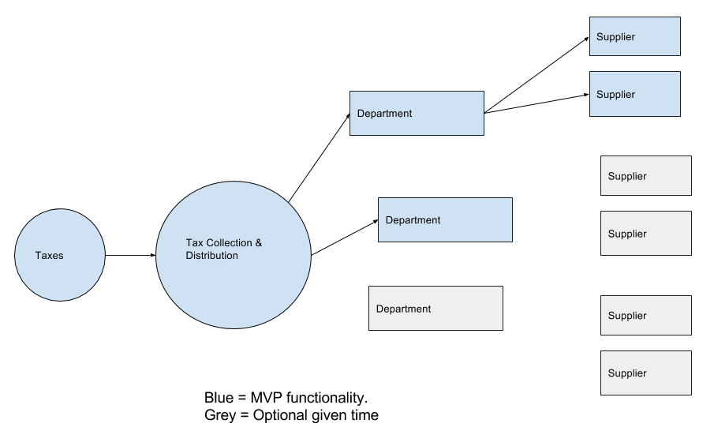

# tax-flow

New Updates at: https://github.com/ced-2017-capstone/tax-flow
Authors:
* Benjamin Brown - benjaminbb@gmail.com
* Mohamed Hasan
* Shaan Ray

This project is presented as a capstone project for the Certified Ethereum Developer program at Blockchain Hub.

This demonstration ethereum blockchain application taxpayer in a hypothetical municipality that runs on a blockchain. We provide a visualization the flow of his transactions through the tax system in real time

# Installation

## Prerequisites
* yarn: `npm install -g yarn`
* truffle: `npm install -g truffle`
* ganache (Ganache)[http://truffleframework.com/ganache/]

## Installation
* pull down repo
* run `yarn` to install dependencies
* start Ganache desktop client - wait until it starts before proceeding
* run `truffle develop`
* run `compile`
* run `migrate`
* open another tab
* run `npm run dev` 
* a browser window should open. If it gives the 'no accounts ..' warning, just refresh browser

  * Note: ctrl+c to stop npm run dev. You will need to open a new tab and close the old one before running `npm run dev` again

## Workflow

## Scope
The goal of this project is to create a proof of concept for a tax distribution system. An indivudual sends their tax payment to their city office. Once the payment is recieved, the city office splits the tax payment received for each department and sends the payment to each department. The Department in turn splits the payment recieved by supplier & invoice and sends payment.

With this contract group, the intention is to create a transparent Tax allocation system that allows an indivdual to see where their tax money is being spent. Additionally, this has the potential to create a publicly approved project system that allows the public to drive the direction of city and government spending.

The first phase of the project is contract creation and testing.
### TODO: 

* Thoroughly test and review iron out contract bugs and architecture
* Implement basic front end to control contract actions from the application itself
* Implement functions in front end to add new Department and Invoice scontracts to the ecosystem
* Further build out invoice submission, requests, and approvale
* Add real-time data visualization linked to contract Events

There are 3 key contracts:
* Taxcollection.sol: This contract recieves the payment. Based on defined splits, the contract allocates payment to the department then creates a function to withdraw payment for the department. In the future, this contract can be modified to allow sender to define the departments they would like their payment applied to. Each department will have payment allocated by either percentage or predefined amounts.

* Department.sol: This contract can be used by multiple departments. This contract receives payment allocated to the department. It then checks for approved suppliers & their associated invoices. This contract also allows new suppliers to be added and removed by owner. eventually, this contracts pays out to approved invoices. In the future, this contract can be modified to apply to specific projects and split payments by project, supplier & invoices. Multiple departments can send payments to each other for collaborative projects.

* invoice.sol: This contract manages the invoicing function. This contract can send an invoice to a department and receive a payment. In the future, this contract can be updated to generate POs and apply POs to departments & projects. These POs can be converted into invoices which will be sent to the departments for payment.

